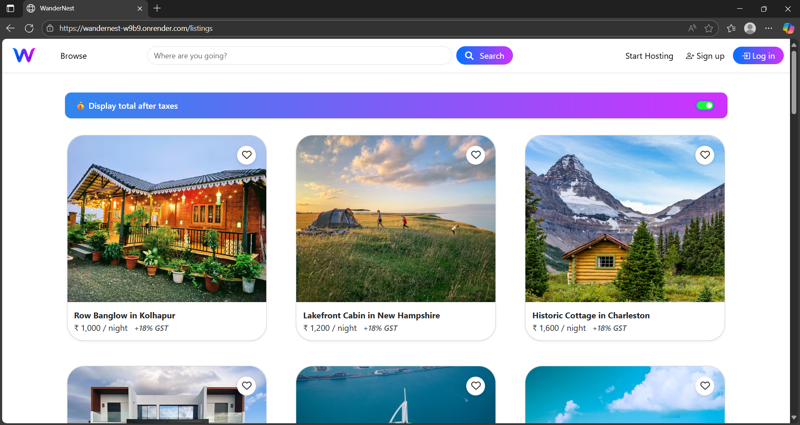
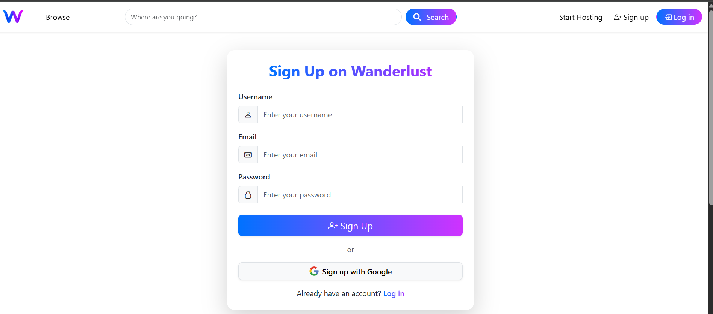
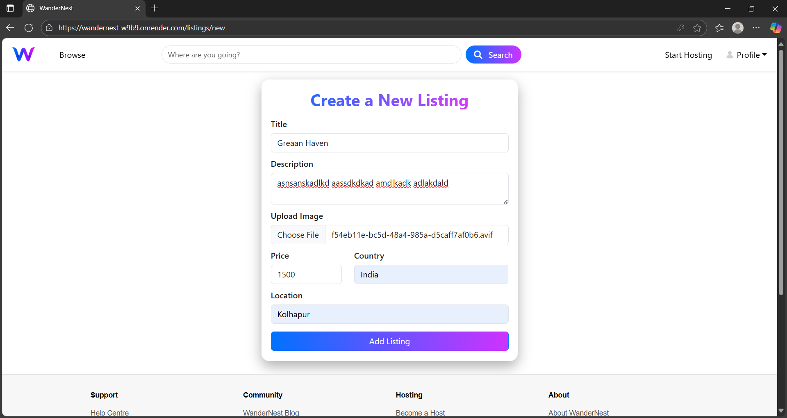
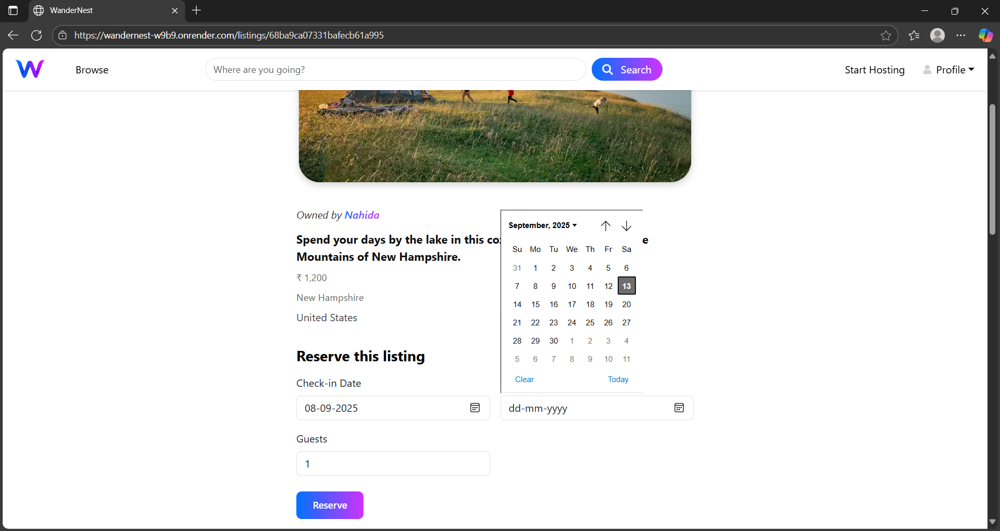
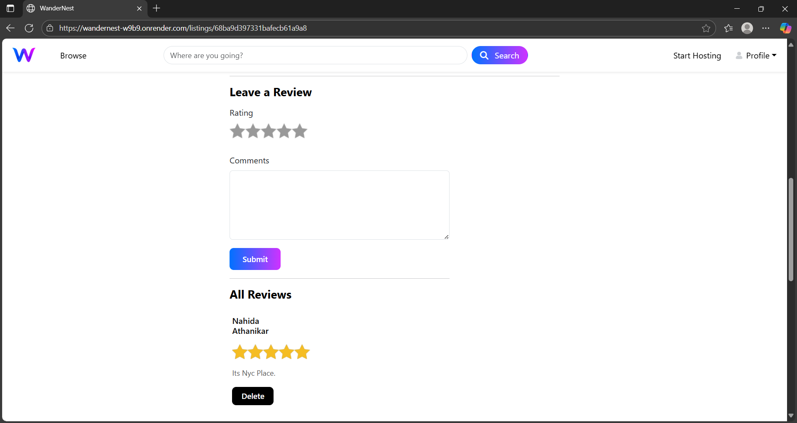

# 🌍 WanderNest – Discover & Book Stays Effortlessly

🚀 **WanderNest** is a full-stack web application that lets users explore destinations, book accommodations, and share reviews — powered with AI-driven search, cloud media uploads, and interactive maps.

---

## ✨ Highlights

✅ **Reserve Listings** – Book stays quickly and easily  
✅ **AI/NLP-Powered Search** – Smarter search experience using Google Gemini + Natural.js  
✅ **Authentication & Authorization** – Secure login with Passport.js  
✅ **Reviews & Ratings** – Users can give feedback, edit or delete their own reviews  
✅ **Cloud Media Uploads** – Fast image uploads via Cloudinary & Multer  
✅ **Interactive Maps** – Explore locations with Mapbox SDK  
✅ **Mobile Responsive** – Smooth UI across all devices  
✅ **Host Your Property** – Allow users to list their own accommodations  
✅ **Secure Sessions** – Reliable session handling with MongoDB and Express-session  
✅ **Deployed on Render** – Live and accessible to all 🌍

💻 **Bonus** – Subtle UI animations for enhanced user experience!

---

## 🧰 Tech Stack
- **Frontend**: Javascript, CSS, Bootstrap, Animation 
- **Backend**: Node.js, Express.js  
- **Database**: MongoDB, Mongoose  
- **Templating**: EJS  
- **AI/NLP**: Google Gemini, Natural.js  
- **Media Handling**: Cloudinary, Multer  
- **Maps**: Mapbox SDK  
- **Authentication**: Passport.js  
- **Hosting**: Render

---

## 📸 Screenshots

_(Add snapshots here to visually showcase your UI)_  
 
 
 
  

---

## 📄 About

This project helped me enhance my skills in:

✅ MERN stack development  
✅ AI/NLP-powered features for better user experience  
✅ Cloud media integration and session security  
✅ Building real-world web apps with interactive maps and responsive design

It's live now and open for exploration!

👉 **Check it out here:** [https://wandernest-w9b9.onrender.com](https://wandernest-w9b9.onrender.com)

---

## 📬 Connect

Feel free to reach out for feedback, collaborations, or opportunities!
