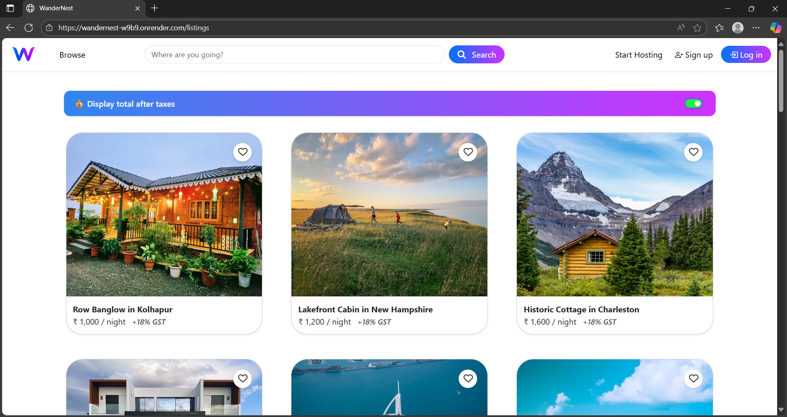
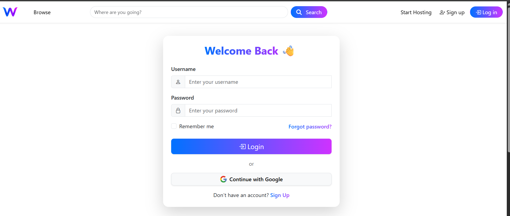
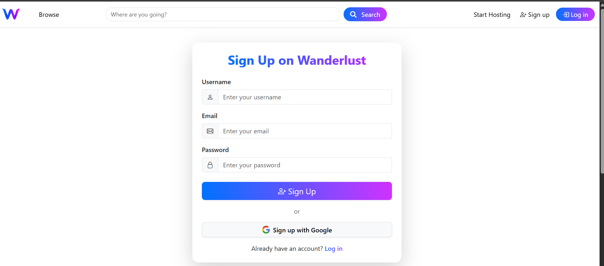
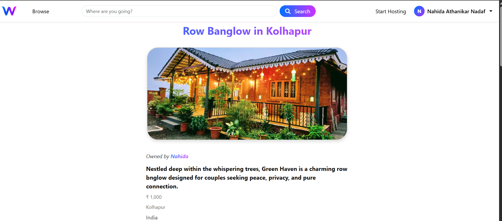
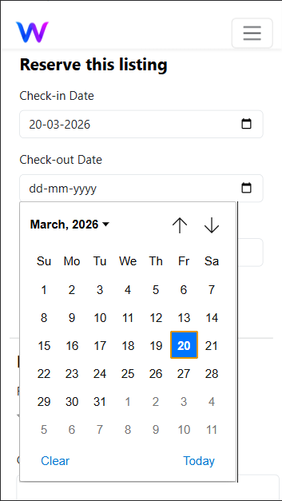
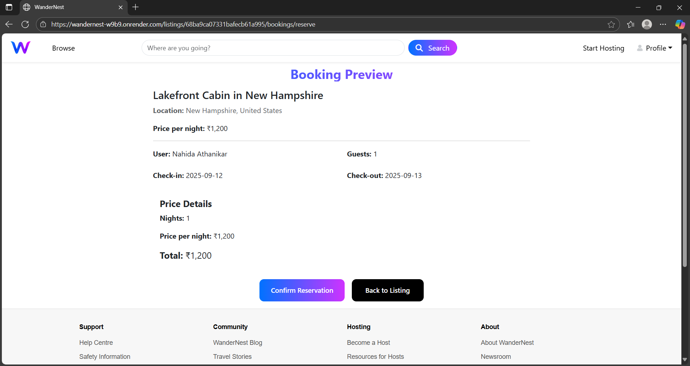
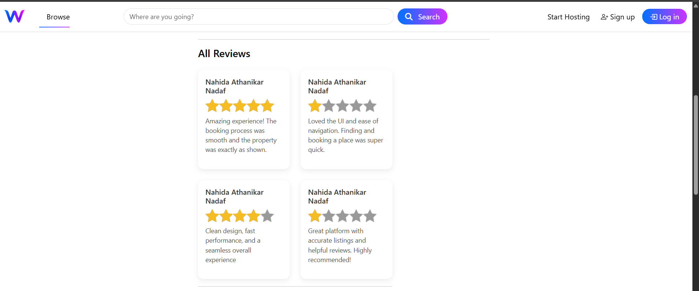
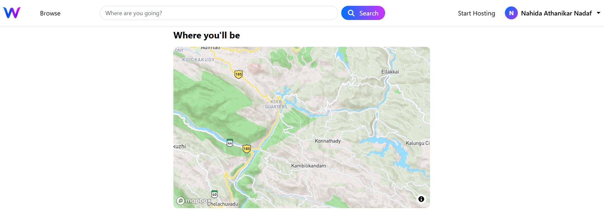

# 🌍 WanderNest – Travel & Stay Booking Platform


🚀 **WanderNest** is a full-stack web application that lets users explore destinations, book accommodations, and share reviews — powered with AI-driven search, cloud media uploads, and interactive maps.

---
## 🚀 Live Demo

🔗 Live Website: https://wandernest.onrender.com  
🔗 GitHub Repository: https://github.com/nahida-athanikar/WanderNest

## 📌 Features

### 🏠 Property Listings
- Create, edit, and delete property listings
- Upload property images
- View detailed listing pages

### 🔐 Authentication & Authorization
- User signup and login system
- Secure session management
- Protected routes for authorized users
- Only listing owners can edit/delete their listings

### ⭐ Reviews & Ratings
- Users can leave reviews on properties
- Delete reviews functionality
- Displays user feedback for better decision making

### 🖼 Image Upload
- Upload listing images using **Multer**
- Store images securely using **Cloudinary**

### 🗺 Location Map
- Integrated **Mapbox API** for displaying property locations
- Helps users visualize where the property is located

### 🤖 AI Search
- AI-powered property search
- Implemented using **Google Gemini API** and **Natural.js**

### 📱 Responsive Design
- Fully responsive UI
- Works across mobile, tablet, and desktop devices

---

## 🛠 Tech Stack

| Layer | Technology Used |
|------|----------------|
| **Frontend** | HTML, CSS, Bootstrap, JavaScript, EJS |
| **Backend** | Node.js, Express.js |
| **Database** | MongoDB with Mongoose |
| **Authentication** | Passport.js, Express Session |
| **Image Management** | Cloudinary, Multer |
| **Maps & Location** | Mapbox API |
| **AI Search** | Google Gemini API, Natural.js |
| **Deployment** | Render |
| **Version Control** | Git & GitHub |

---
## 📂 Project Structure

```
WanderNest
│
├── models
│   ├── listing.js
│   ├── review.js
│   └── user.js
│
├── routes
│   ├── listing.js
│   ├── review.js
│   └── user.js
│
├── controllers
│   ├── listings.js
│   ├── reviews.js
│   └── users.js
│
├── views
│   ├── listings
│   ├── reviews
│   ├── layouts
│   └── partials
│
├── public
│   ├── css
│   ├── js
│   └── images
│
├── middleware
├── utils
│
├── app.js
└── package.json
```
## 📸 Screenshots

<table>
  <tr>
    <td align="center"><b>Screenshot 1</b></td>
    <td align="center"><b>Screenshot 2</b></td>
  </tr>
  <tr>
    <td></td>
    <td></td>
  </tr>
  <tr>
    <td align="center"><i>🏠 All Listings</i></td>
    <td align="center"><i>🔍 Search Listings</i></td>
  </tr>

  <tr>
    <td colspan="2" height="30"></td>
  </tr>

  <tr>
    <td align="center"><b>Screenshot 3</b></td>
    <td align="center"><b>Screenshot 4</b></td>
  </tr>
  <tr>
    <td></td>
    <td></td>
  </tr>
  <tr>
    <td align="center"><i>🔐 Login Page</i></td>
    <td align="center"><i>📝 Signup Page</i></td>
  </tr>

  <tr>
    <td colspan="2" height="30"></td>
  </tr>

  <tr>
    <td align="center"><b>Screenshot 5</b></td>
    <td align="center"><b>Screenshot 6</b></td>
  </tr>
  <tr>
    <td></td>
    <td></td>
  </tr>
  <tr>
    <td align="center"><i>➕ Listing Your Property</i></td>
    <td align="center"><i> Property Details</i></td>
  </tr>

  <tr>
    <td colspan="2" height="30"></td>
  </tr>

  <tr>
    <td align="center"><b>Screenshot 7</b></td>
    <td align="center"><b>Screenshot 8</b></td>
  </tr>
  <tr>
    <td></td>
    <td></td>
  </tr>
  <tr>
    <td align="center"><i>📅 Property Booking (Calendar UI)</i></td>
    <td align="center"><i>✅ Confirm Booking</i></td>
  </tr>

  <!-- 🔥 SPACE ADD HERE -->
  <tr>
    <td colspan="2" height="30"></td>
  </tr>

  <tr>
    <td align="center"><b>Screenshot 9</b></td>
    <td align="center"><b>Screenshot 10</b></td>
  </tr>

  <tr>
    <td></td>
    <td></td>
  </tr>
  <tr>
    <td align="center"><i>All Reviews</i></td>
    <td align="center"><i>Map Feature</i></td>
  </tr>
</table>
---

## 👤 User Workflow

The typical workflow of the WanderNest platform is as follows:

1. **User Registration**
   - A new user creates an account using the signup form.

2. **User Login**
   - Registered users log in securely using their credentials.

3. **Browse Listings**
   - Users can explore available properties on the homepage.

4. **View Property Details**
   - Users can open a listing to view detailed information including images, price, description, and location.

5. **Add a Listing**
   - Authenticated users can create a new property listing by providing property details and uploading images.

6. **Edit / Delete Listing**
   - Property owners can update or remove their listings.

7. **Leave Reviews**
   - Users can add reviews and ratings for properties they have visited.

8. **View Location on Map**
   - Users can view property locations using integrated map services.

9. **Logout**
   - Users can securely logout from the platform.
--- 

## 📦 Installation Guide

### 1️⃣ Clone the Repository

```bash
git clone https://github.com/nahida-athanikar/WanderNest.git
cd WanderNest
```
### 2️⃣Install Dependencies
```bash
npm install
```

### 3️⃣ Add Environment Variables
Create a .env file:
```bash
# Cloudinary Configuration
CLOUDINARY_CLOUD_NAME=your_cloudinary_cloud_name
CLOUDINARY_API_KEY=your_cloudinary_api_key
CLOUDINARY_API_SECRET=your_cloudinary_api_secret

# Mapbox Configuration
MAPBOX_TOKEN=your_mapbox_access_token

# Gemini AI Configuration
GEMINI_API_KEY=your_gemini_api_key

# Session Secret
SESSION_SECRET=your_session_secret
```

```bash
Replace the values with your specific configurations.

```

### 4️⃣ Start the Server
```bash
npm start
```

### 5️⃣ Open App in Browser
Open http://localhost:8080/listings in your web browser.


---

## 👤 Author

**Nahida Athanikar**

[](https://www.linkedin.com/)
[](https://github.com/nahida-athanikar)
[](mailto:your-email@gmail.com)

